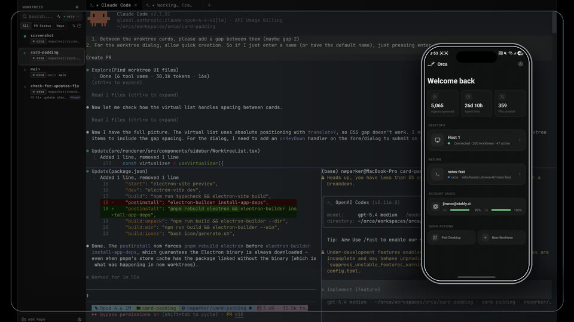
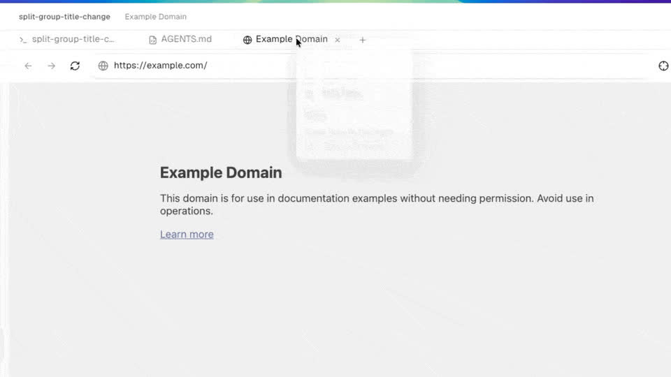
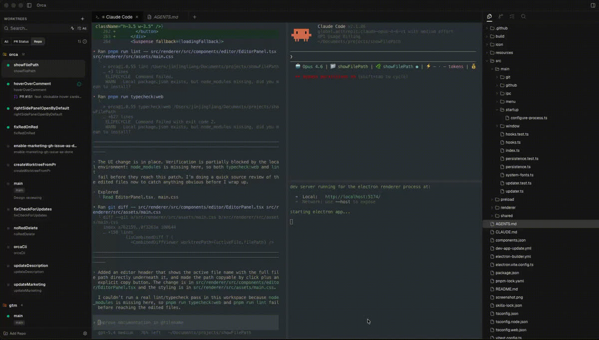
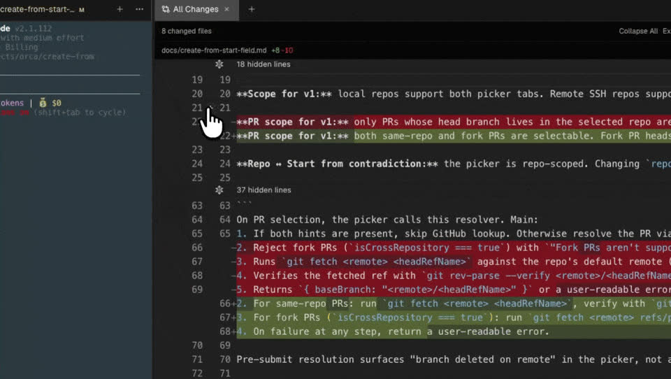
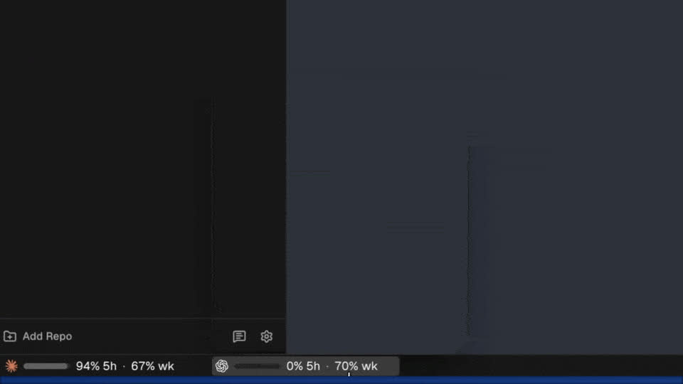

<h1 align="center">
  <a href="https://onOrca.dev"></a> Orca
</h1>

<p align="center">
  
  <a href="https://discord.gg/fzjDKHxv8Q"></a>
  <a href="https://x.com/orca_build"></a>
</p>

<p align="center">
  <a href="../../README.md">English</a> · <a href="README.zh-CN.md">中文</a> · <a href="README.ja.md">日本語</a> · <a href="README.ko.md">한국어</a> · <a href="README.es.md">Español</a>
</p>

<p align="center">
  <strong>100x ビルダーのための AI オーケストレーター。</strong><br/>
  Claude Code、Codex、OpenCode をリポジトリをまたいで並行実行 — それぞれを専用のワークツリーで動かし、1 か所で追跡できます。<br/>
  <strong>macOS、Windows、Linux</strong> で利用できます。
</p>

<p align="center">
  <a href="#インストール"><strong>ダウンロード 🐋</strong></a>
</p>

<p align="center">
  
</p>

## 対応するエージェント

Orca は任意の CLI エージェントに対応しています（*このリストに限定されません*）。

<p>
  <a href="https://docs.anthropic.com/claude/docs/claude-code"><kbd> Claude Code</kbd></a> &nbsp;
  <a href="https://github.com/openai/codex"><kbd> Codex</kbd></a> &nbsp;
  <a href="https://x.ai/cli"><kbd> Grok</kbd></a> &nbsp;
  <a href="https://github.com/google-gemini/gemini-cli"><kbd> Gemini</kbd></a> &nbsp;
  <a href="https://pi.dev"><kbd> Pi</kbd></a> &nbsp;
  <a href="https://hermes-agent.nousresearch.com/docs/"><kbd> Hermes Agent</kbd></a> &nbsp;
  <a href="https://opencode.ai/docs/cli/"><kbd> OpenCode</kbd></a> &nbsp;
  <a href="https://block.github.io/goose/docs/quickstart/"><kbd> Goose</kbd></a> &nbsp;
  <a href="https://ampcode.com/manual#install"><kbd> Amp</kbd></a> &nbsp;
  <a href="https://docs.augmentcode.com/cli/overview"><kbd> Auggie</kbd></a> &nbsp;
  <a href="https://github.com/autohandai/code-cli"><kbd> Autohand Code</kbd></a> &nbsp;
  <a href="https://github.com/charmbracelet/crush"><kbd> Charm</kbd></a> &nbsp;
  <a href="https://docs.cline.bot/cline-cli/overview"><kbd> Cline</kbd></a> &nbsp;
  <a href="https://www.codebuff.com/docs/help/quick-start"><kbd> Codebuff</kbd></a> &nbsp;
  <a href="https://docs.continue.dev/guides/cli"><kbd> Continue</kbd></a> &nbsp;
  <a href="https://cursor.com/cli"><kbd> Cursor</kbd></a> &nbsp;
  <a href="https://docs.factory.ai/cli/getting-started/quickstart"><kbd> Droid</kbd></a> &nbsp;
  <a href="https://docs.github.com/en/copilot/how-tos/set-up/install-copilot-cli"><kbd> GitHub Copilot</kbd></a> &nbsp;
  <a href="https://kilo.ai/docs/cli"><kbd> Kilocode</kbd></a> &nbsp;
  <a href="https://www.kimi.com/code/docs/en/kimi-code-cli/getting-started.html"><kbd> Kimi</kbd></a> &nbsp;
  <a href="https://kiro.dev/docs/cli/"><kbd> Kiro</kbd></a> &nbsp;
  <a href="https://github.com/mistralai/mistral-vibe"><kbd> Mistral Vibe</kbd></a> &nbsp;
  <a href="https://github.com/QwenLM/qwen-code"><kbd> Qwen Code</kbd></a> &nbsp;
  <a href="https://support.atlassian.com/rovo/docs/install-and-run-rovo-dev-cli-on-your-device/"><kbd> Rovo Dev</kbd></a>
</p>

---

## 機能

- **ログイン不要** — お持ちの Claude Code や Codex サブスクリプションをそのまま利用できます。
- **ワークツリーネイティブ** — 各機能は専用のワークツリーで開発できます。スタッシュやブランチ切り替えに悩まず、すぐに作成して切り替えられます。
- **マルチエージェントターミナル** — 複数の AI エージェントをタブやペインで並行実行できます。どれがアクティブかを一目で確認できます。
- **組み込みソース管理** — AI が生成した Diff を確認し、すばやく編集して、Orca から離れずにコミットできます。
- **GitHub 連携** — PR、Issue、Actions チェックが各ワークツリーに自動で紐づきます。
- **SSH サポート** — リモートマシンに接続し、Orca から直接エージェントを実行できます。
- **通知** — エージェントが完了したときや注意が必要なときに通知します。スレッドを未読にして後で戻ることもできます。

---

## インストール

### Mac, Linux, Windows

- **[onOrca.dev からダウンロード](https://onOrca.dev)**
- または **[GitHub Releases ページ](https://github.com/stablyai/orca/releases/latest)** から入手

*パッケージマネージャーからもインストールできます:*

### macOS (Homebrew)

```bash
brew install --cask stablyai/orca/orca
```

### Arch Linux (AUR)

```bash
# ビルド済みバイナリ
yay -S stably-orca-bin

# GitHub ソースからビルド
yay -S stably-orca-git
```

---

## モバイル Companion アプリ

スマートフォンからエージェントを操作できます。

<p align="center">
  <picture><source srcset="../assets/feature-wall/mobile-companion-app-showcase.gif" type="image/gif"></picture>
</p>

- **iOS:** [App Store からダウンロード](https://apps.apple.com/us/app/orca-ide/id6766130217)
- **Android:** [GH release からダウンロード (latest mobile を探してください)](https://github.com/stablyai/orca/releases)

---

## 機能ショーケース

各タイルをクリックすると、そのワークフローを確認できます。

<p align="center">
  <a href="https://www.onorca.dev/docs/model/worktrees"><kbd><strong>並列ワークツリー</strong><br/><br/><picture><source srcset="../assets/feature-wall/parallel-worktrees.gif" type="image/gif"></picture><br/></kbd></a> &nbsp;&nbsp;
  <a href="https://www.onorca.dev/docs/terminal"><kbd><strong>ターミナル分割</strong><br/><br/><picture><source srcset="../assets/feature-wall/terminal-splits.gif" type="image/gif"></picture><br/></kbd></a><br/><br/>
  <a href="https://www.onorca.dev/docs/browser/design-mode"><kbd><strong>デザインモード</strong><br/><br/><picture><source srcset="../assets/feature-wall/design-mode.gif" type="image/gif"></picture><br/></kbd></a> &nbsp;&nbsp;
  <a href="https://www.onorca.dev/docs/review/linear"><kbd><strong>GitHub と Linear をネイティブに</strong><br/><br/><picture><source srcset="../assets/feature-wall/github-linear.gif" type="image/gif"></picture><br/></kbd></a><br/><br/>
  <a href="https://www.onorca.dev/docs/agents/supported"><kbd><strong>任意の CLI エージェント</strong><br/><br/><picture><source srcset="../assets/feature-wall/cli-agents.gif" type="image/gif"></picture><br/></kbd></a> &nbsp;&nbsp;
  <a href="https://www.onorca.dev/docs/ssh"><kbd><strong>SSH ワークツリー</strong><br/><br/><picture><source srcset="../assets/feature-wall/ssh-worktrees.gif" type="image/gif"></picture><br/></kbd></a><br/><br/>
  <a href="https://www.onorca.dev/docs/editing/file-explorer"><kbd><strong>ファイルをエージェントへ</strong><br/><br/><picture><source srcset="../assets/feature-wall/file-drag.gif" type="image/gif"></picture><br/></kbd></a> &nbsp;&nbsp;
  <a href="https://www.onorca.dev/docs/review/annotate-ai-diff"><kbd><strong>AI Diff 注釈</strong><br/><br/><picture><source srcset="../assets/feature-wall/annotate-diff.gif" type="image/gif"></picture><br/></kbd></a><br/><br/>
  <a href="https://www.onorca.dev/docs/cli/overview"><kbd><strong>Orca CLI</strong><br/><br/><picture><source srcset="../assets/feature-wall/orca-cli.gif" type="image/gif"></picture><br/></kbd></a> &nbsp;&nbsp;
  <a href="https://www.onorca.dev/docs/settings"><kbd><strong>ネイティブ検索</strong><br/><br/><picture><source srcset="../assets/feature-wall/keyboard-native.gif" type="image/gif"></picture><br/></kbd></a><br/><br/>
  <a href="https://www.onorca.dev/docs/agents/usage-tracking"><kbd><strong>アカウント切り替えと使用量トラッキング</strong><br/><br/><picture><source srcset="../assets/feature-wall/codex-accounts.gif" type="image/gif"></picture><br/></kbd></a> &nbsp;&nbsp;
  <a href="https://www.onorca.dev/docs/editing/markdown"><kbd><strong>リッチなリポジトリプレビュー</strong><br/><br/><picture><source srcset="../assets/feature-wall/markdown-editor.gif" type="image/gif"></picture><br/></kbd></a><br/><br/>
  <a href="https://www.onorca.dev/docs/model/tabs-panes-splits"><kbd><strong>何でも分割表示</strong><br/><br/><picture><source srcset="../assets/feature-wall/split-screen.gif" type="image/gif"></picture><br/></kbd></a>
</p>

---

## コミュニティとサポート

- **Discord:** **[Discord](https://discord.gg/fzjDKHxv8Q)** のコミュニティに参加してください。
- **Twitter / X:** アップデートやお知らせは **[@orca_build](https://x.com/orca_build)** をフォローしてください。
- **フィードバックとアイデア:** 私たちは高速にリリースしています。足りない機能がありますか？[機能リクエストを送信](https://github.com/stablyai/orca/issues) してください。
- **応援する:** 毎日のリリースを追うために、このリポジトリにスターを付けてください。

---

## 開発について

貢献したい、またはローカルで実行したいですか？ [CONTRIBUTING.md](../.github/CONTRIBUTING.md) ガイドをご覧ください。
